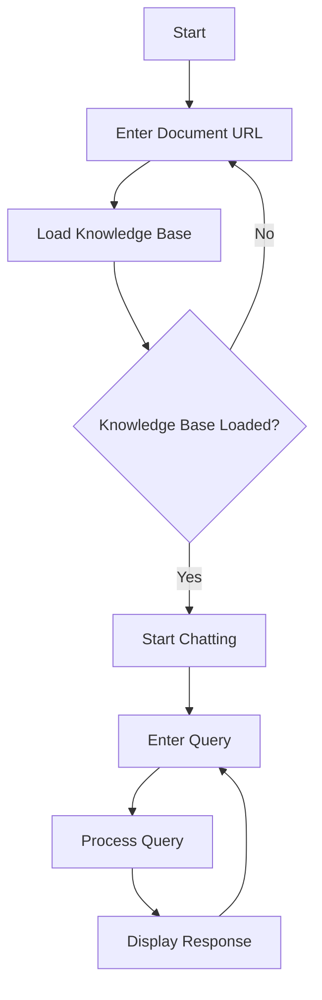

# LLM Applications

This repository will contain various applications that leverage Large Language Models (LLMs) or Vision Language Models (VLMs) for various tasks.


## Applications

### 1. [RAG Chatbot](./simple_chat.py)

A Retrieval-Augmented Generation (RAG) chatbot that allows users to load a knowledge base from a URL and interact with it through a conversational interface. The chatbot uses advanced NLP techniques to provide context-aware answers based on the loaded documents.

#### Overview

This Streamlit application implements a Retrieval-Augmented Generation (RAG) chatbot that allows users to load a knowledge base from a URL and interact with it through a conversational interface. The chatbot uses advanced NLP techniques to provide context-aware answers based on the loaded documents.

#### Features

- 🌐 Web-based Document Loading
- 💬 Interactive Chat Interface
- 🔍 Retrieval-Augmented Generation
- 📚 Dynamic Knowledge Base Integration
- 🛡️ Error Handling and Logging

#### Prerequisites

Before running the application, ensure you have the following installed:

- Python 3.11+
- Ollama
- OpenAI-compatible API endpoint

#### Installation

1. Clone the repository:
```bash
git clone https://github.com/yourusername/llm-applications.git
cd llm-applications
```

2. Create a virtual environment:
```bash
python -m venv venv
source venv/bin/activate  # On Windows, use `venv\Scripts\activate`
```

3. Install required dependencies:
```bash
pip install -r requirements.txt
```

4. Set up environment variables:
Create a `.env` file in the project root with the following variables:
```
OLLAMA_HOST=http://localhost
OLLAMA_PORT=11434
```

#### Required Libraries

- streamlit
- langchain
- bs4
- dotenv
- langchain_openai
- langchain_ollama
- faiss-cpu

#### Configuration

##### Embedding Model
- Uses `nomic-embed-text` from Ollama
- Ensure the model is downloaded and available

##### Language Model
- Uses Meta Llama 3.1 405B Instruct
- Configured through an OpenAI-compatible API endpoint

#### Running the Application

```bash
streamlit run simple_chat.py
```

#### Usage

1. **Load Knowledge Base**
   - Enter a URL containing the documents you want to query
   - Click "Load Knowledge Base"

2. **Chat Interface**
   - After loading the knowledge base, start asking questions
   - The chatbot will retrieve and generate answers based on the loaded documents

#### Workflow



#### Troubleshooting

- Ensure Ollama and the embedding model are running
- Check API endpoint connectivity
- Verify document URL accessibility

#### Customization

- Modify chunk size in `RecursiveCharacterTextSplitter`
- Change embedding or language models
- Adjust logging levels

## Contributing

1. Fork the repository
2. Create your feature branch
3. Commit your changes
4. Push to the branch
5. Create a Pull Request

## License

MIT License

## Acknowledgments

- Streamlit
- LangChain
- Ollama
- Meta AI

## TODO

- [ ] Add more robust error handling
- [ ] Implement advanced filtering
- [ ] Add support for multiple document types
